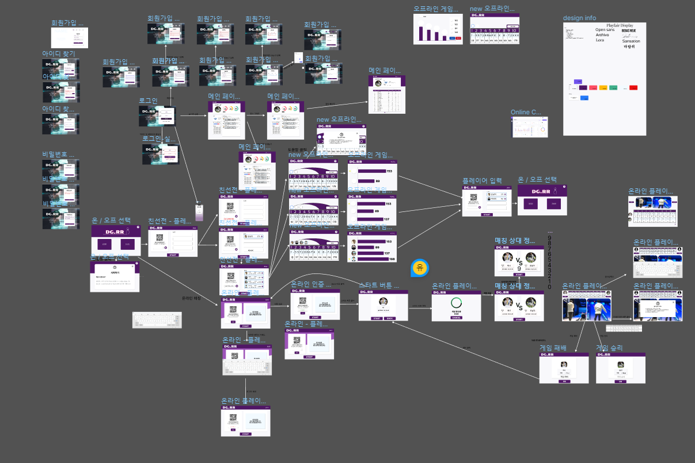
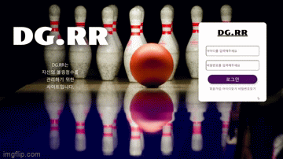
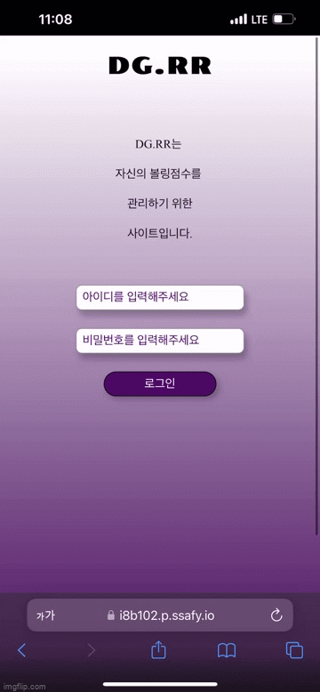

# READ ME

## 프로젝트 이름 및 설명

## 프로젝트 정보

### 프로젝트 진행기간

- 2023년 1월 3일 ~ 2023년 2월 17일(6주)

### 역할 
- 프론트엔드
  - 김지환
    - 프론트엔드 리드 
    - webrtc 구현 
    - 회원(로그인, 회원가입, 아이디찾기, 비밀번호 찾기) 구현 
  - 허정범
  - 유덕균
- 백엔드
  - 유현근
  - 김성준

### 기획의도

- 자신의 볼링의 평균 에버리지, 게임 내역을 통계로 기록하고 관리하고 싶은 경우
- 다양한 사람들과 볼링 실력을 겨루고 싶은 경우
- 볼링을 치고 싶은데 같이 칠 사람이 없어서 아쉬운 경우

### 차별점

- 매칭 시스템을 통해서 다양한 사람들과 경쟁을 할 수 있다.
- 비슷한 수준의 사람들과 볼링을 즐길 수 있다.
- 장소에 상관없이 어디서나 다른 사람들과 함께 볼링을 즐길 수 있다.

## 기술 스택 및 개발환경

### 프론트엔드

- React : 16.12.0
- Redux : 8.0.5
- node-scss : 7.0.3

### 백엔드

### WebRTC
- openvidu - 2.25.0
### OS

- Windows 10

### IDE

- Visual Studio Code : 1.70.2

## 프로젝트 산출물

### 와이어프레임 & 프로토타이핑

https://www.figma.com/file/G3HUKIc3OH0Iu0LoSM0BM4/CPR_%EB%8D%B0%EA%B5%AC%EB%A5%B4%EB%A5%B4pjt?node-id=0%3A1&t=dYIMfnU22YfQpPDt-0

### ERD

### API 명세서

https://docs.google.com/spreadsheets/d/1fleu_UsQB1oBSR718Zg1wQuL53ImlN3P1EY-rRA98LE/edit#gid=0
 

## 주요 기능

 

### 태블릿 환경

#### 경쟁전(1:1 화상채팅)

- 선행
  - 키오스크(태블릿환경)에서 경쟁전을 선택을 할 시 큐알코드로 로그인을 해야 한다.
  - 모바일로 큐알코드를 인식을하여 로그인을 한 뒤 핀번호(일회용번호)를 입력을 하게 되면 해당 계정으로 로그인을 할 수 있다.
  - 게임 시작을 누르고 자신의 랭킹점수에 맞는 상대와 매칭이 될 때까지 게임을 기다린다.
  - 매칭이 잡히게 되면 자신의 프로필과 상대 프로필의 정보가 주어지고 카운트 다운 10초가 주어진다.
  - 카운트 다운이 끝난 뒤 두 사람만 들어갈 수 있게 세션을 만들고 두 사용자는 그 방에 들어가게되면서 각자의 화면이 나오게 된다.
  - 두 사용자가 점수를 다 입력을 하게되면 승패 결과를 알려준다.
- 로직 구현
  - 

#### 친선전(오프라인 게임)

- 최대 4인까지 로그인을 할 수 있다.(태블릿 환경)
- 각 프로필을 클릭을 하게 되면 각 사용자에 맞는 점수가 나오게 되면서 입력을 할 수 있다.
- 사용자의 점수를 다 입력을 하게 되면 최종결과를 그래프로 보여준다.

### 모바일 환경

#### 핀번호

- 키오스크(태블릿환경)에 접속을 하기 위해서 모바일에서 로그인을 하여 각 계정에 맞는 핀번호를 발급받을 수 있다.
- 유효시간은 5분이며 유효시간이 다 되었으면 자동적으로 발급을 받게 한다.

### PC 환경

#### 점수 통계

- 자신의 에버리지 점수를 확인할 수 있다.
- 랭킹전을 통해서 자신의 순위와 랭크를 알 수 있다.
- 자신의 최근 전적을 통해서 승패 기록을 확인 할 수 있다.

## 기능구현

 

### PC 환경

 

#### 로그인

#### 회원가입

#### 아이디찾기

#### 비밀번호 찾기

#### 메인페이지(전적관리)

#### 메인페이지(랭킹페이지)

#### 메인페이지(상대전적확인)

 

### 모바일 환경

 

#### 로그인

#### 핀번호(일회용번호) 발급

 

### 태블릿(키오스크) 환경

 

#### 경쟁전(온라인매칭) 로그인

#### 경쟁전(온라인매칭) 게임시작

#### 경쟁전(온라인매칭) 매칭 결과

#### 경쟁전(온라인매칭) 게임 화면

#### 경쟁전(온라인매칭) 게임 결과

 

#### 친선전(오프라인) 로그인

#### 친선전(오프라인) 게임화면

#### 친선전(오프라인) 게임결과
