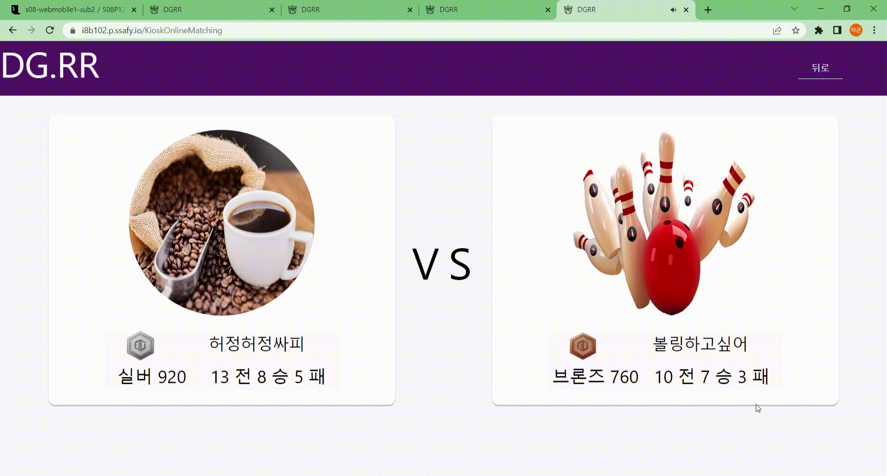
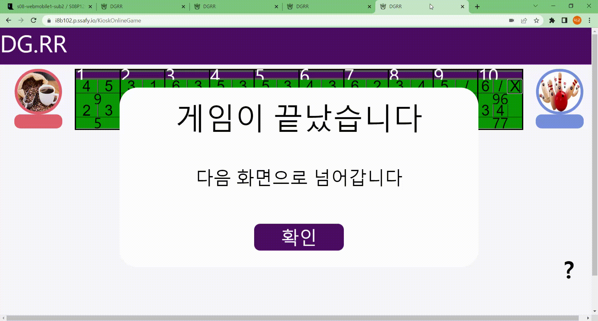

# READ ME

## 프로젝트 이름 및 설명

## 프로젝트 정보

### 프로젝트 진행기간

- 2023년 1월 3일 ~ 2023년 2월 17일(6주)

### 역할 
- 프론트엔드
  - 김지환
    - 프론트엔드 리드 
    - webrtc 구현 
    - 회원(로그인, 회원가입, 아이디찾기, 비밀번호 찾기) 구현 
    - 모바일 로그인, 핀번호 발급 구현
  - 허정범
  - 유덕균
- 백엔드
  - 유현근
  - 김성준

### 기획의도

- 자신의 볼링의 평균 에버리지, 게임 내역을 통계로 기록하고 관리하고 싶은 경우
- 다양한 사람들과 볼링 실력을 겨루고 싶은 경우
- 볼링을 치고 싶은데 같이 칠 사람이 없어서 아쉬운 경우

### 차별점

- 매칭 시스템을 통해서 다양한 사람들과 경쟁을 할 수 있다.
- 비슷한 수준의 사람들과 볼링을 즐길 수 있다.
- 장소에 상관없이 어디서나 다른 사람들과 함께 볼링을 즐길 수 있다.

## 기술 스택 및 개발환경

### 프론트엔드

- React : 16.12.0
- Redux : 8.0.5
- node-scss : 7.0.3

### 백엔드

### WebRTC
- openvidu - 2.25.0
### OS

- Windows 10

### IDE

- Visual Studio Code : 1.70.2

## 프로젝트 산출물

### 와이어프레임 & 프로토타이핑

https://www.figma.com/file/G3HUKIc3OH0Iu0LoSM0BM4/CPR_%EB%8D%B0%EA%B5%AC%EB%A5%B4%EB%A5%B4pjt?node-id=0%3A1&t=dYIMfnU22YfQpPDt-0

### ERD

### API 명세서

https://docs.google.com/spreadsheets/d/1fleu_UsQB1oBSR718Zg1wQuL53ImlN3P1EY-rRA98LE/edit#gid=0
 

## 주요 기능

 

### 태블릿 환경

#### 경쟁전(1:1 화상채팅)

- 선행
  - 키오스크(태블릿환경)에서 경쟁전을 선택을 할 시 큐알코드로 로그인을 해야 한다.
  - 모바일로 큐알코드를 인식을하여 로그인을 한 뒤 핀번호(일회용번호)를 입력을 하게 되면 해당 계정으로 로그인을 할 수 있다.
  - 게임 시작을 누르고 자신의 랭킹점수에 맞는 상대와 매칭이 될 때까지 게임을 기다린다.
  - 매칭이 잡히게 되면 자신의 프로필과 상대 프로필의 정보가 주어지고 카운트 다운 10초가 주어진다.
  - 카운트 다운이 끝난 뒤 두 사람만 들어갈 수 있게 세션을 만들고 두 사용자는 그 방에 들어가게되면서 각자의 화면이 나오게 된다.
  - 두 사용자가 점수를 다 입력을 하게되면 승패 결과를 알려준다.
- 로직 구현
  - 

#### 친선전(오프라인 게임)

- 최대 4인까지 로그인을 할 수 있다.(태블릿 환경)
- 각 프로필을 클릭을 하게 되면 각 사용자에 맞는 점수가 나오게 되면서 입력을 할 수 있다.
- 사용자의 점수를 다 입력을 하게 되면 최종결과를 그래프로 보여준다.

### 모바일 환경

#### 핀번호

- 키오스크(태블릿환경)에 접속을 하기 위해서 모바일에서 로그인을 하여 각 계정에 맞는 핀번호를 발급받을 수 있다.
- 유효시간은 5분이며 유효시간이 다 되었으면 자동적으로 발급을 받게 한다.

### PC 환경

#### 점수 통계

- 자신의 에버리지 점수를 확인할 수 있다.
- 랭킹전을 통해서 자신의 순위와 랭크를 알 수 있다.
- 자신의 최근 전적을 통해서 승패 기록을 확인 할 수 있다.

## 기능구현

 

### PC 환경

 

#### 로그인

#### 회원가입

#### 아이디찾기

#### 비밀번호 찾기

#### 메인페이지(전적관리)

#### 메인페이지(랭킹페이지)

#### 메인페이지(상대전적확인)

 

### 모바일 환경

 

#### 로그인

#### 핀번호(일회용번호) 발급

 

### 태블릿(키오스크) 환경

 

#### 경쟁전(온라인매칭) 로그인

- QR코드를 인식하여 나온 온라인 페이지에서 온라인 사용자는 PIN 번호를 발급받아 입력하는 것으로 경쟁전을 위한 간편 로그인이 가능하다.
- 로그인을 하고 나면 자신의 프로필과 전적이 및 랭킹이 환영문구를 대신하여 화면에 나타나고 다음으로 진행하여 매칭찾기 화면으로 이동할 수 있다.

#### 경쟁전(온라인매칭) 게임시작

- 게임을 시작하고나면 매칭찾기 화면이 우선 나타나 사용자가 매칭을 위해 기다리는 시간을 표시하여 주고, 만약 사용자가 원한다면 매칭찾기 과정을 취소할 수도 있다.
- 매칭 상대는 평소의 전적과 랭킹을 우선적으로 고려하여 찾는다.
- 매칭을 찾고 나면 사용자는 그것을 팝업 화면으로 고지받으며 약 5초간 준비시간이 주어진다.

#### 경쟁전(온라인매칭) 매칭 결과

- 온라인 매칭 결과로 만나게된 상대의 프로필 정보와 자신의 프로필 정보를 함께 보여주어 어떤 사람과 상대를 하게 될지 알려준다.
- 잠시뒤, 양측에게 각각 10초의 준비시간이 주어지고 이후 게임 화면으로 이동한다.

#### 경쟁전(온라인매칭) 게임 화면

- 게임이 시작되면 자신과 상대의 점수표가 화면 상단에 나타나고, 하단에 자신을 비추는 화면과 상대를 비추는 화면이 함께 나타난다.
- 매칭을 진행하는 사람들은 서로 인사를 교환하고, 이후 게임을 진행하며 각각 자신이 얻는 점수를 상단의 점수판에 스스로 기록한다.
- 점수판은 자신과 상대의 입력을 지속적으로 동기화하여 서로의 경기 상황을 알 수 있게 한다.
- 점수판은 사용자의 입력에 반응하여 실시간으로 그 유효성을 검증하고 만약 입력값이 유효하지 않을 경우 적절히 수정하거나 혹은 입력을 받아들이지 않는 방식으로 응답한다.

#### 경쟁전(온라인매칭) 게임 결과

- 게임 총점을 비교하여 승패를 결정짓고 각 플레이어에게 이를 알려주는 동시에 그 플레이어들의 기존의 점수를 승패에 따라 조정한다.
- 다음 버튼을 누르면 처음의 화면으로 돌아간다.

 

#### 친선전(오프라인) 로그인

- 오프라인은 여러 사람이 동시에 로그인 할 수 있으며 각 플레이어들은 QR 코드를 찍어 나오는 화면에서 얻은 Pin번호를 입력하는 것으로 오프라인 게임에 참가한다.
- 로그인 할 경우 그 사람의 프로필과 정보를 표기해주며, 오프라인 게임은 각 게임당 최대 4인까지 참여할 수 있다.

#### 친선전(오프라인) 게임화면

- 게임이 진행되는 동안 각 플레이어들은 자신의 프로필 사진을 누르는 행동을 통해 자신의 점수판을 불러올 수 있다.
- 점수판은 온라인과 동일하게 입력값의 유효성을 검증하고, 유효하지 않을 경우 이를 수정하거나 입력을 받지 않는 방식으로 응답한다.
- 모든 플레이어가 모든 게임 정보를 입력 완료한다면 게임이 종료되었다는 팝업 메시지를 띄우고 사용자들을 다음 결과화면으로 이동시킨다.

#### 친선전(오프라인) 게임결과

- 여러 사람의 게임 총점을 비교하여 그 총점들을 가로 차트를 통해 표현한다.
- 각 플레이어들의 총점의 비율에 따라 차트의 길이를 결정하여 사용자들에게 보여준다.
