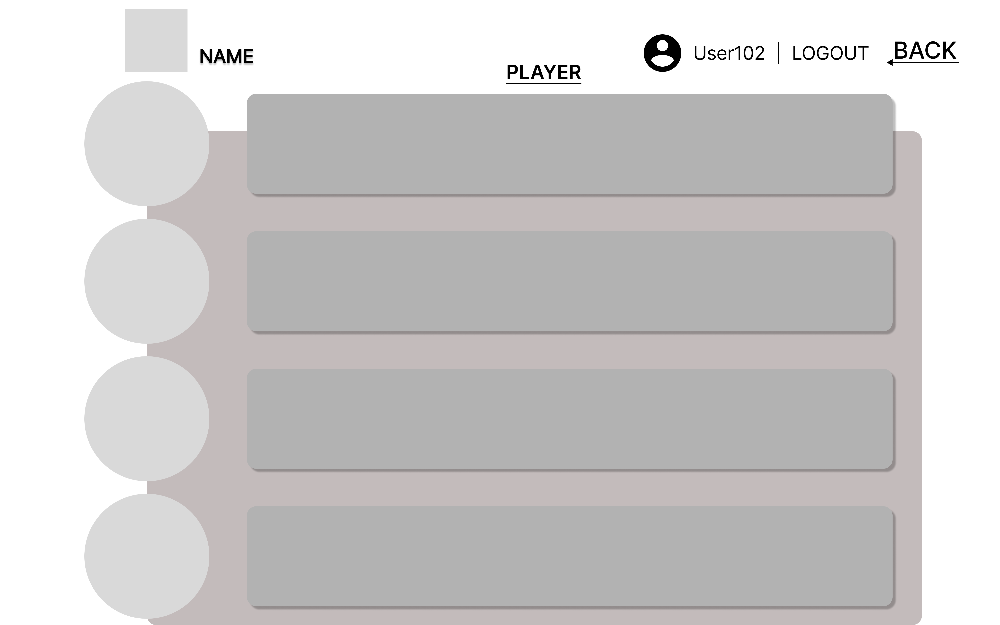

# 와이어프레임 제작

# 결과

 
 
 

# 새로이 배운 것

## 피그마의 기능들

- 개체를 선택하고 Alt 키를 누르고 거리를 재기 원하는 개체에 마우스 오버하면 거리가 측정된다.

- section을 선택하고 preference => nudge amount를 선택하면 화면에 픽셀 측정용 메쉬를 입힐 수 있다.

- Shift 키를 누르고 방향키를 누르면 위에서 설정해둔 메쉬단위로 움직일 수 있다.

- 개체를 선택하고 Alt키와 함께 드래그 하면 복사를 사용할 수 있다.

- 여러 개체를 선택하기 위해서는 Shift키를 누르고 개체를 클릭하면 된다.

- 플러그인 기능을 사용하면 더 편리하게 디자인을 할 수 있다.
    * Iconify를 사용하면 여러 아이콘들을 쉽게 입력할 수 있다.
    * Forms를 사용하면 여러 폼들을 간단하게 입력할 수 있다.

## 디자인 포인트

- 8포인트 그리드를 염두에 두고 디자인하면 깔끔한 화면을 만들 수 있다.

# 어려웠던 점

디자인 그 자체가 어느정도 감각을 요구하는 일이다보니 디자인과는 영 거리가 멀던 자신에게는 상당히 어려운 일이었다. 일단은 팀원들의 아이디어를 모방하는 방향으로 나아가고 있지만, 이것을 해결하는 방법은 꾸준히 좋은 디자인을 접해보는 수 밖에는 없다고 생각한다.

8포인트 그리드를 위해 모든 것을 8픽셀의 배수로 맞추려하니 상당히 머리가 아픈 곤란한 작업이었다. 익숙해지면 애초에 디자인을 시작할때부터 8의 배수를 상정하고 움직이는 방법등으로 어느정도 쉽게 작업을 해낼 수 있지 않을까 생각한다.

피그마를 다루는 작업은 쉽지 않았다. 하지만 위의 여러 기능들을 피어 러닝을 통해 익히고 나니 어느정도 속도를 붙힐 수 있었다.