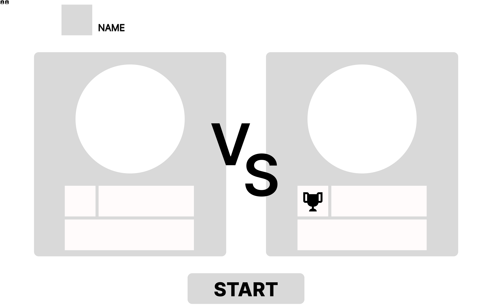

# 와이어프레임 제작

# 결과

 
 
 

# 새로이 배운 것

## 피그마의 기능들

- i를 누르면 스포이드를 사용하여 요소로부터 색을 추출할 수 있다.

- 요소의 색을 결정하는 내용에서 solid가 아닌 다른 옵션을 선택하면 다양한 그라데이션을 설정할 수 있다.

# 어려웠던 점

- 그라데이션은 다루기 어렵다... 경험이 쌓이기 전에는 건드리지 않는 것이 나을 것 같다.