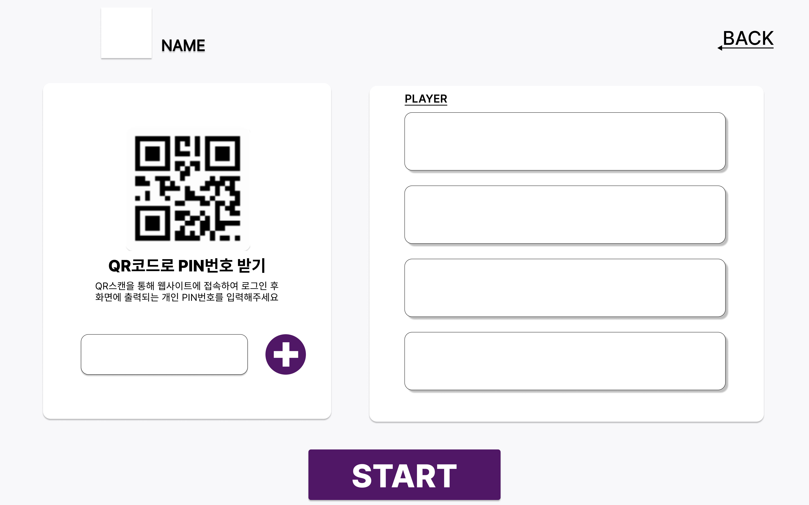
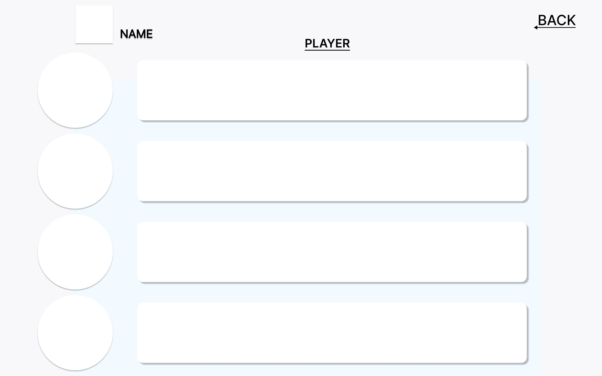
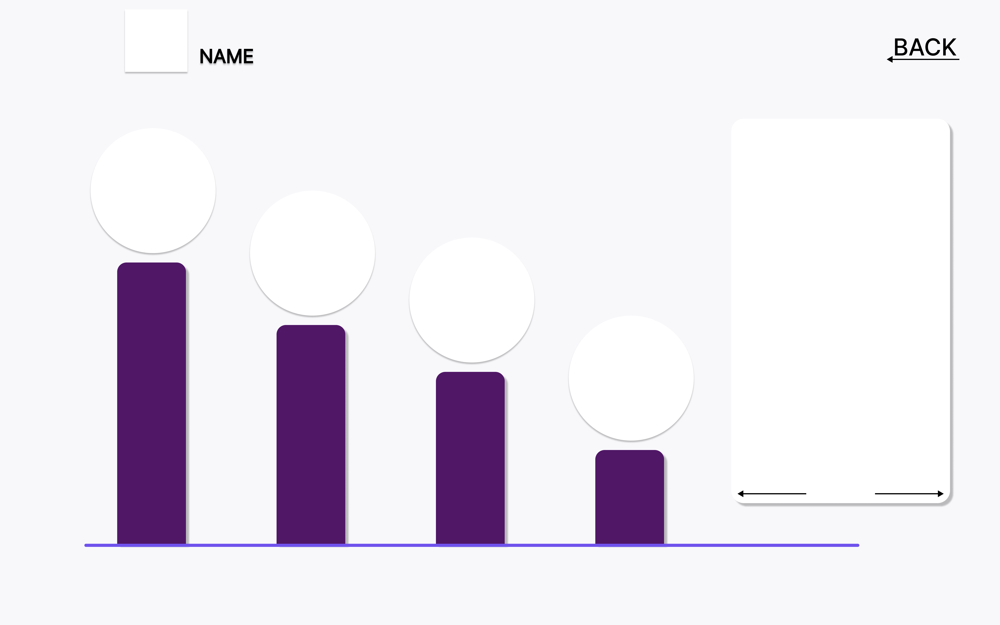

# 목업 제작

# 결과

 
 
 

 
 
 

# 새로이 배운 것

## 피그마의 기능들

- Shift + a 를 누르면 특정 이벤트에 대응하여 변화하는 요소를 정의해둘 수 있다.

- plugin에서 talewind를 사용하면 명암비에 따른 여러 색상들을 사용할 수 있다.

# 어려웠던 점

- 디자인을 위해 만들어져있는 인터넷 사이트들이 여럿 있다. 그들을 참조하여 디자인에 대한 힌트를 얻는 것이 좋아보인다. 하지만 그럼에도 불구하고 결국 디자인은 스스로 결정하여 만들어내는 것이다. 오늘 우리팀 역시, 그저 다른 사람의 디자인을 참조하는 것이 아니라 그것에서 파생된 새로운 디자인을 만들어내어 적용하였다. 주 색 2개와 보조 색 1개 정도가 항상 적당하고 깔끔하며, 단순하지만 부족하지 않은 디자인이라는 것이 이번에 드러났다.