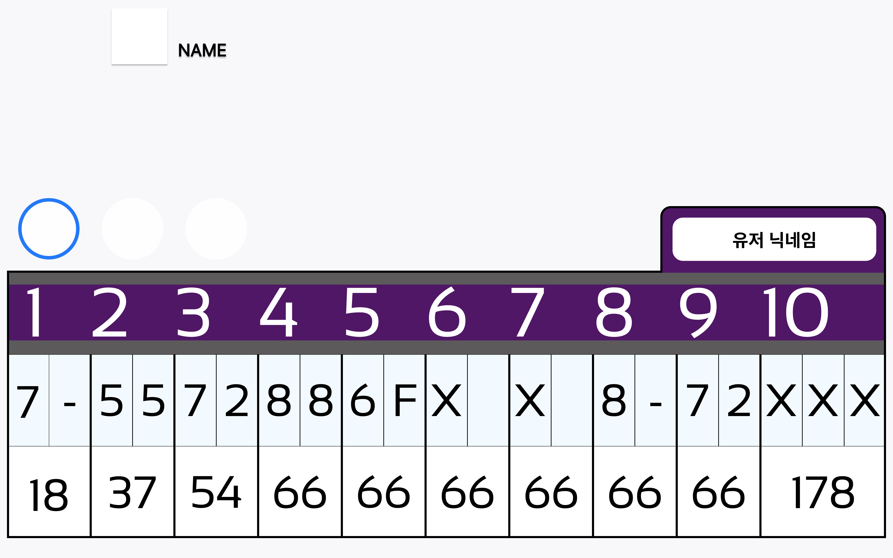
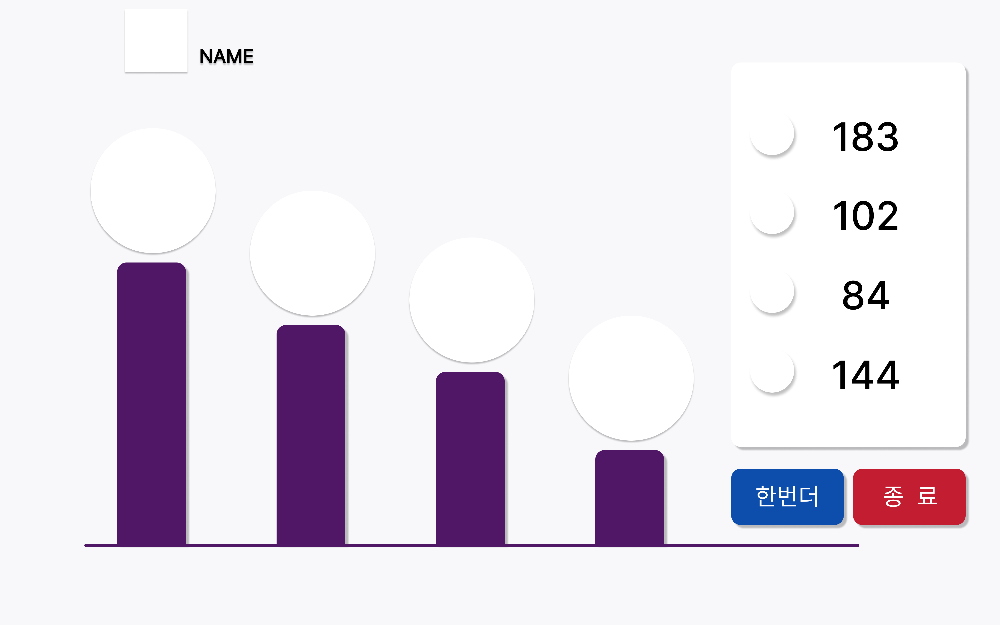
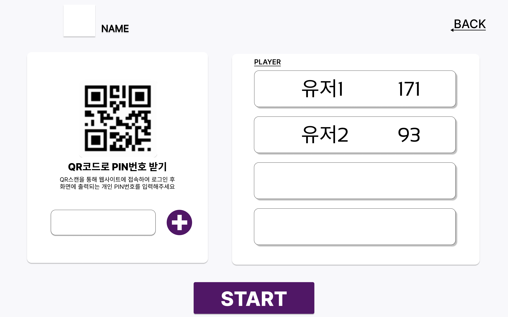
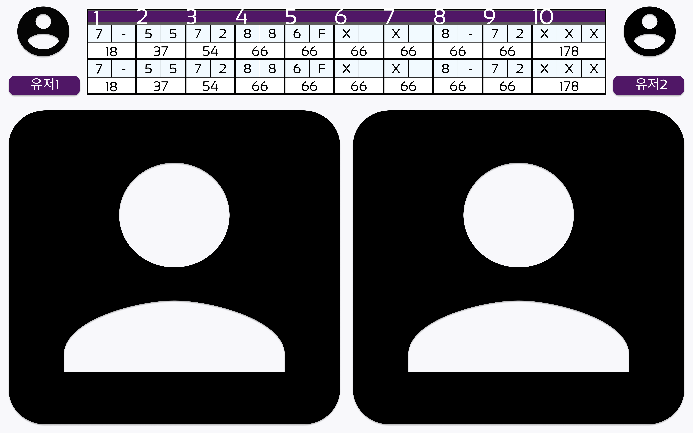

# # 목업 제작

# 결과

 
 
 

 
 
 

 
 
 

# 새로이 배운 것

## 피그마의 기능들

- Ctrl + g를 사용하면 그룹을 지정하여 묶어둘 수 있다. 크기를 조절하면 내부의 모든 요소가 함께 조절된다.

# 어려웠던 점

- 디자인을 돕기위해 만들어져 있는 사이트가 엄청 많다는 것을 알았다. 이런 사이트들을 적극적으로 활용하여 관련된 경험을 많이 쌓는것이 디자인에 좋은 영향을 줄 수 있을 듯하다.