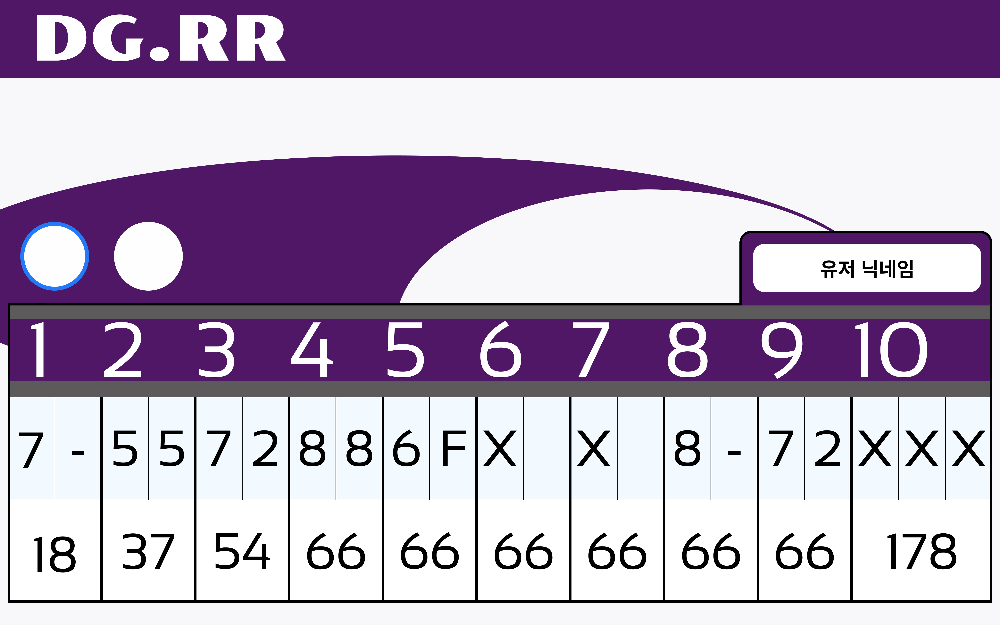
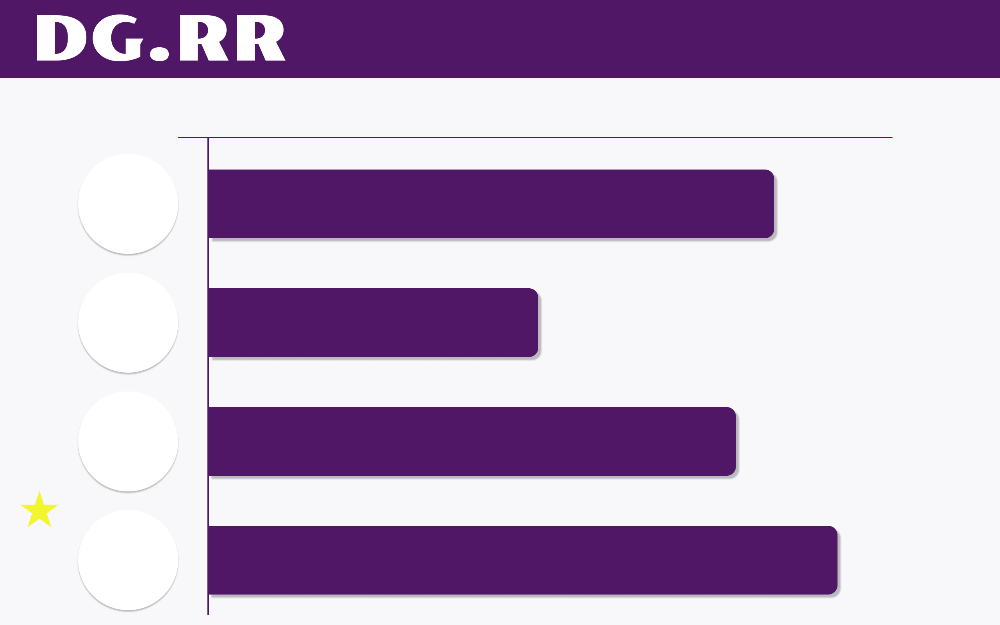
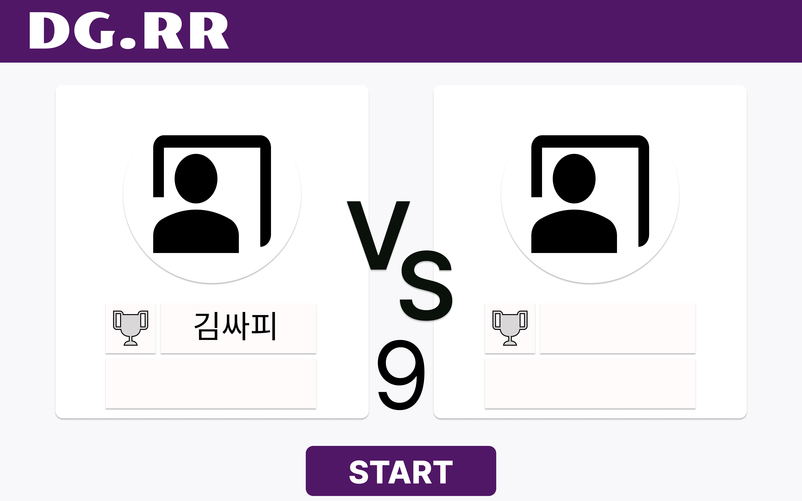
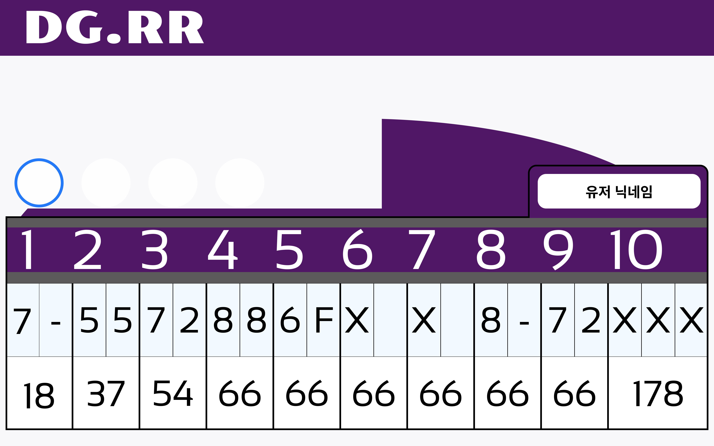

# # 목업 제작

# 결과

 
 
 

 
 
 

 
 
 

# 새로이 배운 것

## 피그마의 기능들

- variant set을 설정하는 것으로 특정한 상황에 반응하여 변화하는 요소들을 정의해둘 수 있다.

- prototype 탭에서 실제 서비스를 사용하고 있는 것처럼 움직이도록 만들 수 있다.

# 깨달은점

- 그냥 별 생각없이 도형들을 배치하는 것도 디자인 아이디어를 줄 수 있다. 허전한 부분들을 적절히 잘 채운 것 같아 기쁘다.