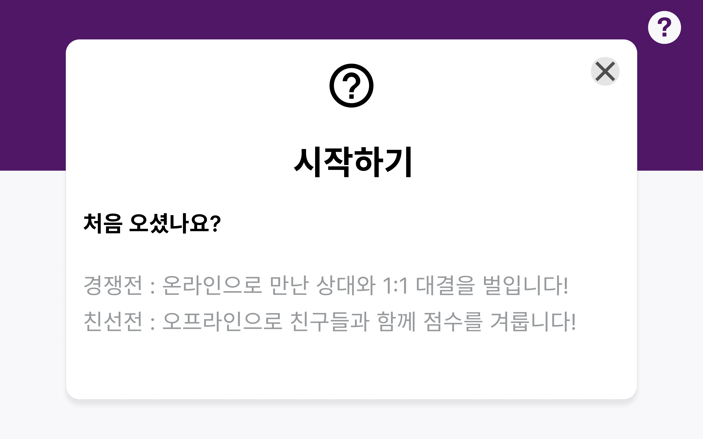
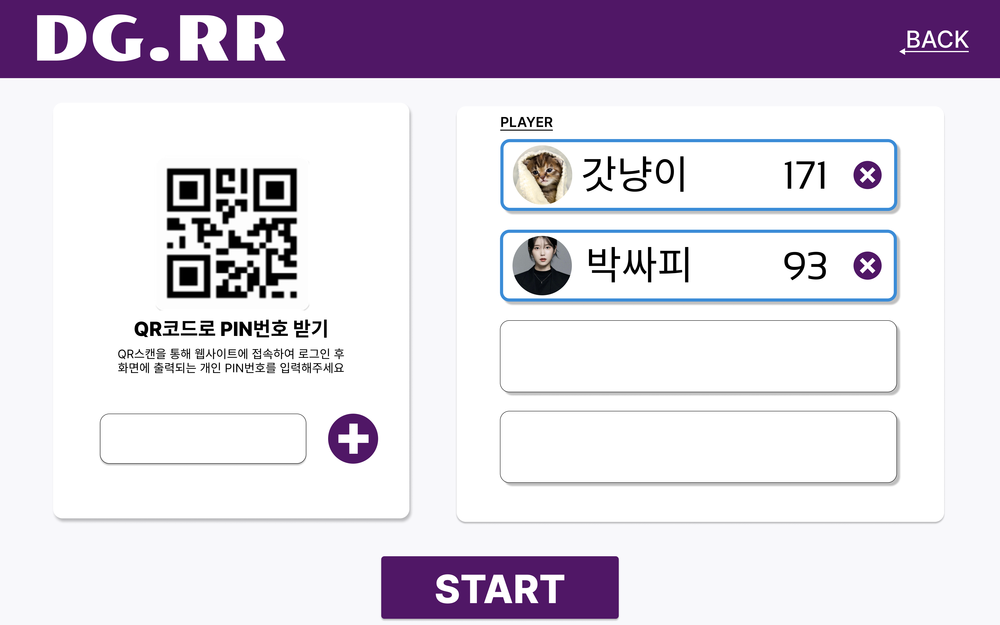
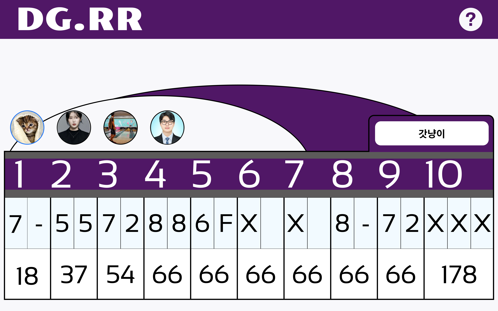
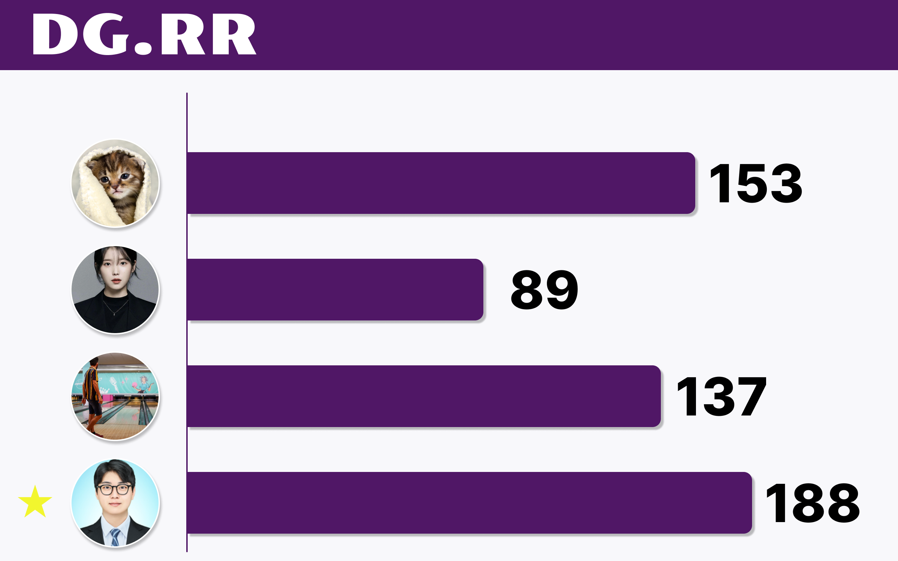
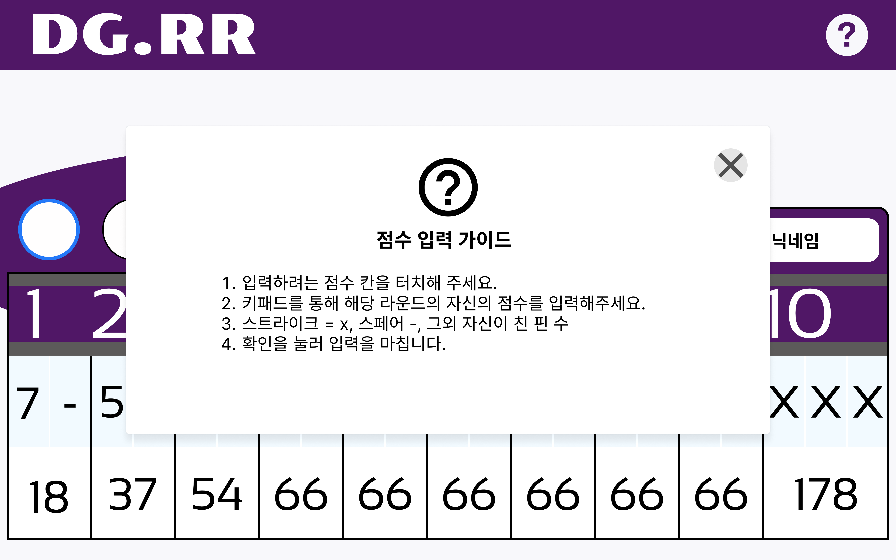

# 목업 제작

# 결과

 
 
 

 
 
 

 
 
 

 
 
 

# 새로이 배운 것

## 깃

- git checkout -b "만들려는 브랜치" "복사하려는 브랜치" => 원하는 브랜치를 복제하여 현재 브랜치를 만들 수 있다.

# 깨달은점

- 피그마를 사용하면 사실상 거의 모든 프로토타입 제작 과정을 완료할 수 있다. 이것을 공부하여 두어도 많은데에 쓰일 수 있을 것이라 생각한다.