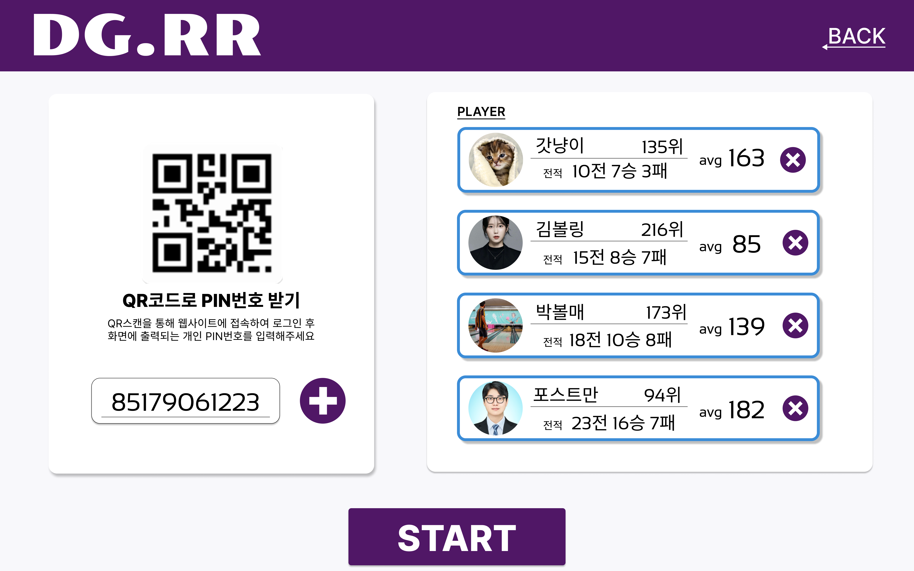
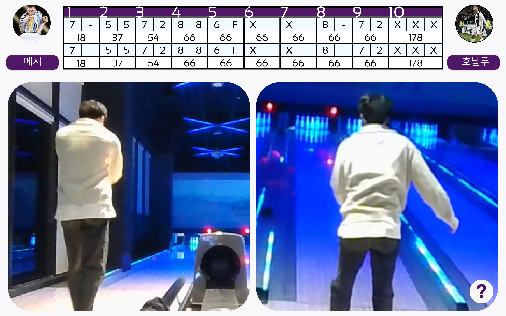

# 목업 제작

# 결과

 
 
 

# 새로이 배운 것

## 깃

- git checkout -t origin/브랜치이름 => 원격 저장소에 있는 브랜치를 같은 이름으로 현재 로컬에 복사해올 수 있다.

## 피그마

- Alt + 더블클릭 으로 가져온 이미지를 자를 수 있다.

## CSS

- em은 현재 요소의 폰트 크기에 비례한 길이 값(폰트 크기 X 숫자), rem은 root의 폰트 크기에 비례한 길이 값(폰트 크기 X 숫자)
- 따라서 되도록 rem을 기준으로하여 디자인하는 것을 권장