# DGRR 프로젝트

# 목차
- [프로젝트 팀원 및 역할 소개](#프로젝트-팀원-및-역할-소개)
- [프로젝트 디테일](#프로젝트-디테일)
- [기술 스택 및 개발환경](#기술-스택-및-개발환경)
- [프로젝트 문서](#프로젝트-문서)
- [주요 기능](#태블릿-환경)

# 프로젝트 팀원 및 역할 소개
|구분|이름|역할|디테일|
|----|----|----|----|
|팀장|김성준|백엔드|DB 설계 및 구현, RESTAPI, API Docs, ERD, 요구사항 명세서, 볼링장 및 볼링시스템 컨텍|
|팀원|유현근|배포, 백엔드| Docker, nginx, 배포(스프링,리액트 서버), 로그인(spring security) UCC, PPT, 발표, 포트포워딩|
|팀원|김지환|프론트엔드|WebRTC(OPENVIDU) 구현, 회원(로그인, 회원가입, 아이디찾기, 비밀번호 찾기) 구현, 모바일 핀 발급 페이지 구현|
|팀원|유덕균|프론트엔드| 매칭 구현, 실시간 볼링계산 로직 구현, 볼링 온라인매칭(경쟁전) 구현, 친선전(오프라인) 구현, 게임 결과 페이지 구현|
|팀원|허정범|프론트엔드|메인페이지 구현, 랭킹페이지 구현, 협업을 위한 노션페이지 관리|
<br/><br/>

# 프로젝트 디테일
## 프로젝트 타이틀


## 프로젝트 기간
- 2023년 1월 3일 ~ 2023년 2월 17일(6주)

## 프로젝트 개요
- DG.RR은 볼링게임데이터 매니징 서비스로 에버리지, 승률, 티어, 랭킹 등 다양한 통계 정보 및 화상채팅을 통한 실시간 경쟁전 매칭, 최대 4인 까지 오프라인에서 즐길 수 있는 오프라인 게임을 제공합니다.

## 기획배경
  - 많은 사람들이 볼링 경기 후, 자신의 경기 기록을 하려하여도 마땅한 방법이 없어 그대로 잊혀지거나, 엑셀파일에 자신의 경기를 불편하게 관리를 하는 경우가 많습니다.
  - 주변 사람들 뿐만 아니라 자신과 비슷한 수준의 다양한 사람들과 게임을 하고 싶은 경우가 있으나 현실적으로 어려움이 많습니다.
  - 볼링장에 가고 싶어도 볼링장에 같이 갈 사람이 없거나 약속을 잡기 어려운 경우가 많습니다.
  - 이러한 상황을 타개하기 위해 DGRR을 기획하게 되었습니다.

## 주요 기능
  - 자신의 볼링 게임 통계 조회(볼링 평균 에버리지, 승률, 랭킹, 티어)
  - 실시간 경쟁전(온라인) 매칭
  - 최대 4인의 오프라인 게임
  - 온라인 오프라인 게임을 통한 자동 점수 기록

## 프로젝트의 특장점
  - 자신의 볼링게임 정보를 체계적으로 관리할 수 있습니다.
  - 매칭 시스템을 통해서 다양한 사람들과 경쟁을 할 수 있습니다.
  - 비슷한 수준의 사람들과 볼링을 즐길 수 있습니다.
  - 오프라인 게임을 통해 친구들과 함께한 게임도 기록할 수 있습니다.
  - 장소에 상관없이 어디서나 다른 사람들과 함께 볼링을 즐길 수 있습니다


<br/><br/>

## 기술 스택 및 개발환경

<hr/>

### 프론트엔드
- React : 16.12.0
- Redux : 8.0.5
- node-scss : 7.0.3

### 백엔드
- Spring Boot : 2.7.7
- Java : 17.0.6

### DB
- MySQL : 8.0.31

### 배포
- Docker : 23.0.0
- nginX : 1.18.0

### WebRTC
- openvidu - 2.25.0

### OS
- Windows 10

### IDE
- Visual Studio Code : 1.70.2
- SpringToolSuite : 4.17.1.
- MySQL Workbench 8.0 CE

### 협업도구
  - Jira
  - Notion
  - GitLab
  - Mattermost
  - Discord
  - Webex

### 유틸
  - figma
  - postman

### 디바이스
  - 갤럭시탭 S8

### 컨벤션
- 깃 컨벤션
```
# 기본 포맷
- type(옵션):Subject Text
	ex) Docs : Add 로그인 기능
```
|옵션|의미|
|----|----|
|Feat|새로운 기능을 추가할 경우|
|Fix|버그를 고친 경우|
|Design|CSS 등 사용자 UI 디자인 변경|
|!BREAKING CHANGE|커다란 API 변경의 경우|
|!HOTFIX|급하게 치명적인 버그를 고쳐야하는 경우|
|Style|코드 포맷 변경, 세미 콜론 누락, 코드 수정이 없는 경우|
|Refactor|프로덕션 코드 리팩토링|
|Comment|필요한 주석 추가 및 변경|
|Docs|문서를 수정한 경우|
|Test|테스트 추가, 테스트 리팩토링(프로덕션 코드 변경 X)|
|Chore|빌드 태스트 업데이트, 패키지 매니저를 설정하는 경우(프로덕션 코드 변경 X)|
|Rename|파일 혹은 폴더명을 수정하거나 옮기는 작업만인 경우|
|Remove|파일을 삭제하는 작업만 수행한 경우|
|Dir|폴더를 새로 생성하거나 구조를 변경할 떄|

<br/><br/>

# 프로젝트 문서
1. 요구사항 명세서
2. 와이어프레임 & 목업
3. 아키텍쳐
4. ERD
5. API Docs

## [1. 요구사항 명세서](https://docs.google.com/spreadsheets/d/1-ezhG40OMM_bPJSZlESB4eKfkUY_n38BLaOWilCTmco/edit#gid=0)
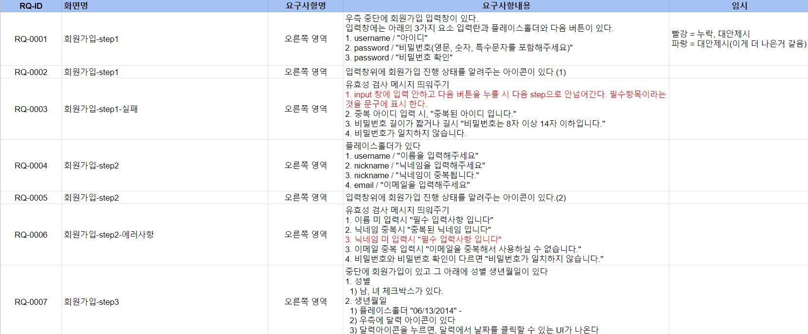

<br/><br/>

## [2. 와이어프레임 & 목업](https://www.figma.com/file/G3HUKIc3OH0Iu0LoSM0BM4/CPR_%EB%8D%B0%EA%B5%AC%EB%A5%B4%EB%A5%B4pjt?node-id=0%3A1&t=dYIMfnU22YfQpPDt-0)


<br/><br/>

## 3. 아키텍쳐
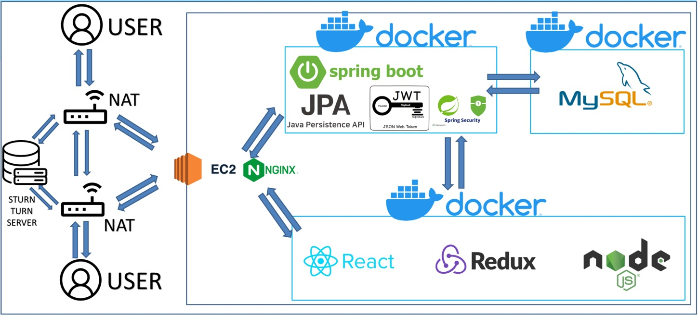

<br/><br/>

## [4. ERD](https://www.erdcloud.com/d/X3aAdeCjgT3opoxxy)
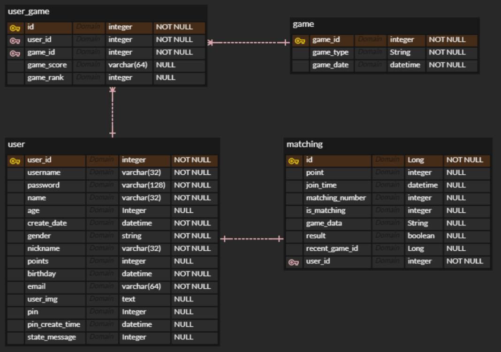

<br/><br/>

## [5. API Docs](https://docs.google.com/spreadsheets/d/1fleu_UsQB1oBSR718Zg1wQuL53ImlN3P1EY-rRA98LE/edit#gid=0)


<br/><br/>

# 협업 관리
1. Jira
2. Notion
3. GitLab


## 1. Jira
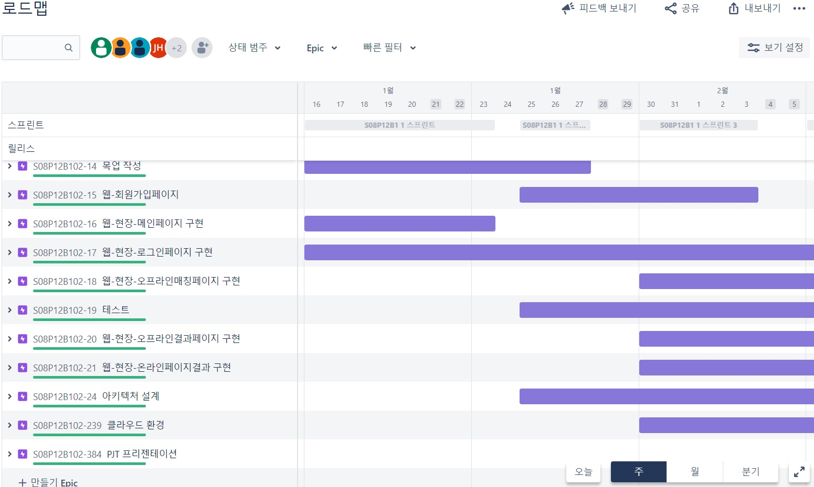
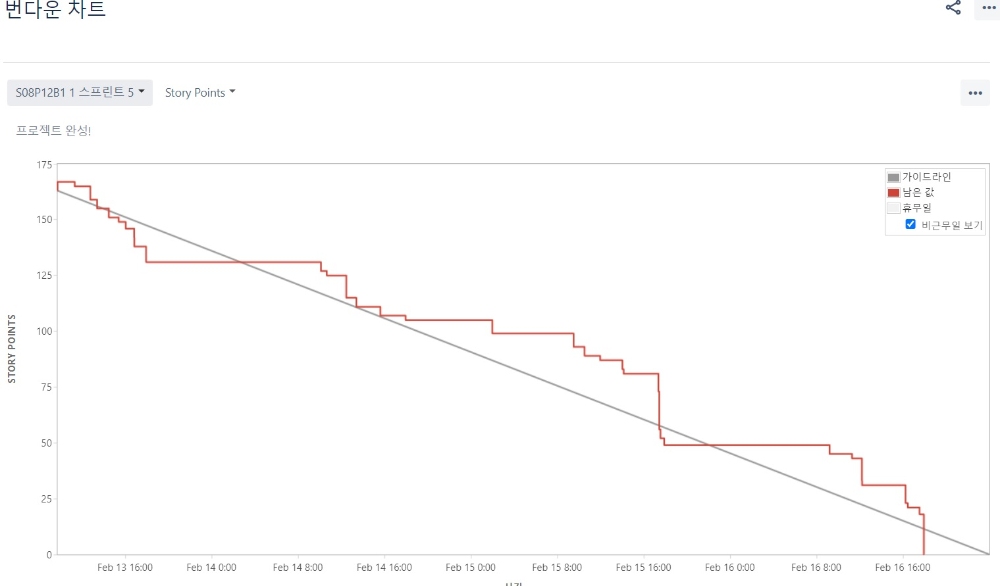

<br/><br/>

## 2. [Notion](https://www.notion.so/B102-CPR-PJT-2ab1c2b21c8a42f4832a742f28c8a763)
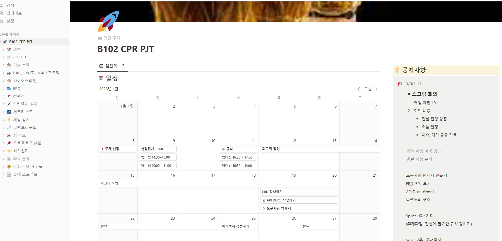
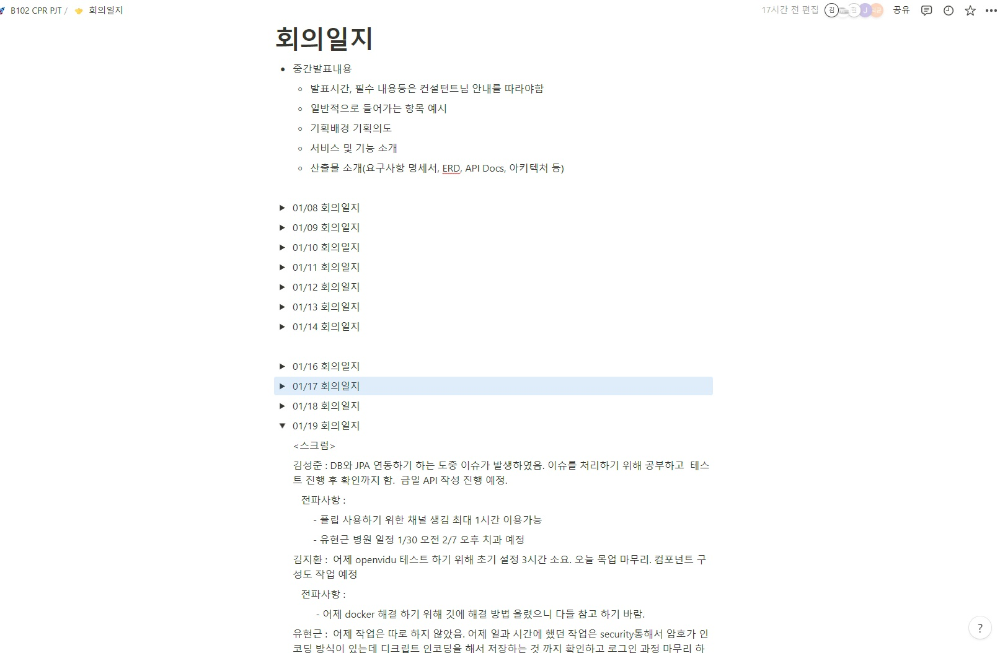
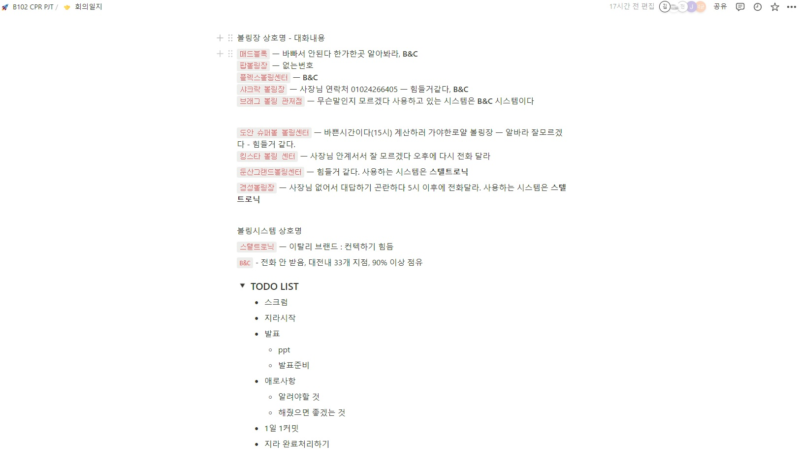


<br/><br/>

## 3. Mattermost
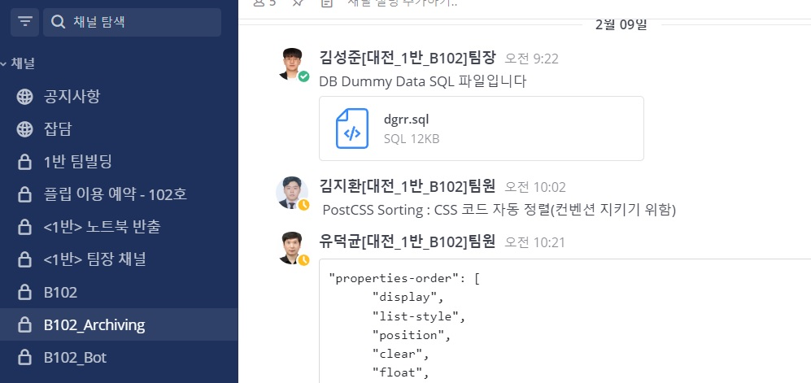

<br/>
<br/>

<br/>

# 주요기능

## 태블릿 환경

## 경쟁전(1:1 화상채팅)

- 선행
  - 키오스크(태블릿환경)에서 경쟁전을 선택을 할 시 큐알코드로 로그인을 해야 한다.
  - 모바일로 큐알코드를 인식을하여 로그인을 한 뒤 핀번호(일회용번호)를 입력을 하게 되면 해당 계정으로 로그인을 할 수 있다.
  - 게임 시작을 누르고 자신의 랭킹점수에 맞는 상대와 매칭이 될 때까지 게임을 기다린다.
  - 매칭이 잡히게 되면 자신의 프로필과 상대 프로필의 정보가 주어지고 카운트 다운 10초가 주어진다.
  - 카운트 다운이 끝난 뒤 두 사람만 들어갈 수 있게 세션을 만들고 두 사용자는 그 방에 들어가게되면서 각자의 화면이 나오게 된다.
  - 두 사용자가 점수를 다 입력을 하게되면 승패 결과를 알려준다.
- 로직 구현
  - 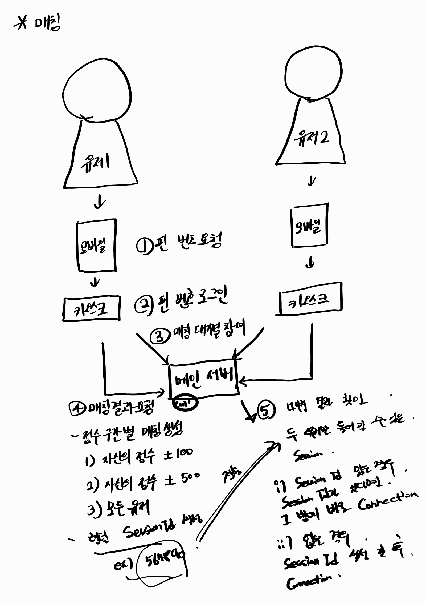

## 친선전(오프라인 게임)

- 최대 4인까지 로그인을 할 수 있다.(태블릿 환경)
- 각 프로필을 클릭을 하게 되면 각 사용자에 맞는 점수가 나오게 되면서 입력을 할 수 있다.
- 사용자의 점수를 다 입력을 하게 되면 최종결과를 그래프로 보여준다.

# 모바일 환경


## 핀번호

- 키오스크(태블릿환경)에 접속을 하기 위해서 모바일에서 로그인을 하여 각 계정에 맞는 핀번호를 발급받을 수 있다.
- 유효시간은 5분이며 유효시간이 다 되었으면 자동적으로 발급을 받게 한다.
<br/>

# PC 환경

## 점수 통계

- 자신의 에버리지 점수를 확인할 수 있다.
- 랭킹전을 통해서 자신의 순위와 랭크를 알 수 있다.
- 자신의 최근 전적을 통해서 승패 기록을 확인 할 수 있다.

<br/><br/>

# 기능구현

<br/>

## PC 환경

<br/>

### 로그인

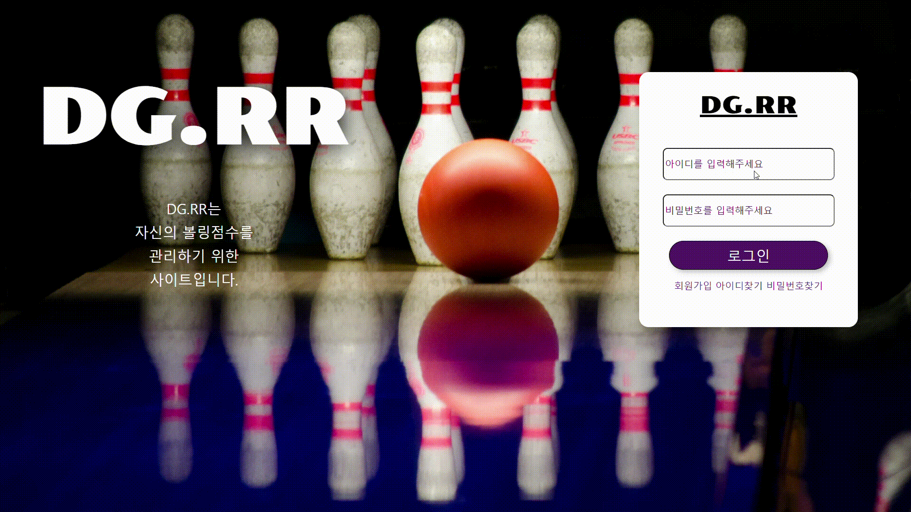

### 회원가입


### 아이디찾기


### 비밀번호 찾기


### 메인페이지(전적관리)
- 본인의 AVG, 티어, 승률 확인이 가능하다
- 그래프 등을 통해 본인 실력 변화를 시각적으로 보여준다.
- 해당 서비스를 통해 진행한 게임의 전적을 카테고리별 조회가 가능하다.


### 유저 랭킹페이지
- 본인의 티어, 랭킹, 포인트 등을 간략하게 볼 수 있다.
- 해당 서비스를 사용하는 모든 유정의 랭킹 및 전적 정보를 확인할 수 있다.


### 메인페이지(상대전적확인)
- 랭킹 보드의 전적확인을 원하는 플레이어 선택시 해당 플레이 전적관리 페이지로 이동할 수 있다.


<br/>

## 모바일 환경

<br/><br/>

### 로그인


### 핀번호(일회용번호) 발급

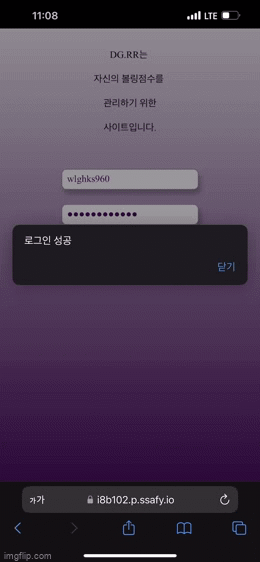

<br/>

## 태블릿(키오스크) 환경

<br/>

### 경쟁전(온라인매칭) 로그인

- QR코드를 인식하여 나온 온라인 페이지에서 온라인 사용자는 PIN 번호를 발급받아 입력하는 것으로 경쟁전을 위한 간편 로그인이 가능하다.
- 로그인을 하고 나면 자신의 프로필과 전적이 및 랭킹이 환영문구를 대신하여 화면에 나타나고 다음으로 진행하여 매칭찾기 화면으로 이동할 수 있다.

### 경쟁전(온라인매칭) 게임시작

- 게임을 시작하고나면 매칭찾기 화면이 우선 나타나 사용자가 매칭을 위해 기다리는 시간을 표시하여 주고, 만약 사용자가 원한다면 매칭찾기 과정을 취소할 수도 있다.
- 매칭 상대는 평소의 전적과 랭킹을 우선적으로 고려하여 찾는다.
- 매칭을 찾고 나면 사용자는 그것을 팝업 화면으로 고지받으며 약 5초간 준비시간이 주어진다.


### 경쟁전(온라인매칭) 매칭 결과

- 온라인 매칭 결과로 만나게된 상대의 프로필 정보와 자신의 프로필 정보를 함께 보여주어 어떤 사람과 상대를 하게 될지 알려준다.
- 잠시뒤, 양측에게 각각 10초의 준비시간이 주어지고 이후 게임 화면으로 이동한다.

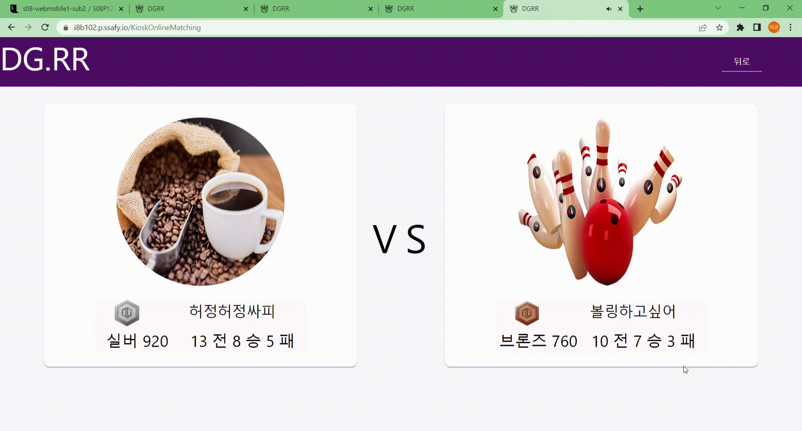


### 경쟁전(온라인매칭) 게임 화면

- 게임이 시작되면 자신과 상대의 점수표가 화면 상단에 나타나고, 하단에 자신을 비추는 화면과 상대를 비추는 화면이 함께 나타난다.
- 매칭을 진행하는 사람들은 서로 인사를 교환하고, 이후 게임을 진행하며 각각 자신이 얻는 점수를 상단의 점수판에 스스로 기록한다.
- 점수판은 자신과 상대의 입력을 지속적으로 동기화하여 서로의 경기 상황을 알 수 있게 한다.
- 점수판은 사용자의 입력에 반응하여 실시간으로 그 유효성을 검증하고 만약 입력값이 유효하지 않을 경우 적절히 수정하거나 혹은 입력을 받아들이지 않는 방식으로 응답한다.


### 경쟁전(온라인매칭) 게임 결과

- 게임 총점을 비교하여 승패를 결정짓고 각 플레이어에게 이를 알려주는 동시에 그 플레이어들의 기존의 점수를 승패에 따라 조정한다.
- 다음 버튼을 누르면 처음의 화면으로 돌아간다.

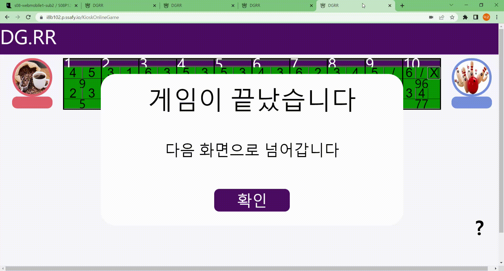

<br/>

### 친선전(오프라인) 로그인

- 오프라인은 여러 사람이 동시에 로그인 할 수 있으며 각 플레이어들은 QR 코드를 찍어 나오는 화면에서 얻은 Pin번호를 입력하는 것으로 오프라인 게임에 참가한다.
- 로그인 할 경우 그 사람의 프로필과 정보를 표기해주며, 오프라인 게임은 각 게임당 최대 4인까지 참여할 수 있다.

### 친선전(오프라인) 게임화면

- 게임이 진행되는 동안 각 플레이어들은 자신의 프로필 사진을 누르는 행동을 통해 자신의 점수판을 불러올 수 있다.
- 점수판은 온라인과 동일하게 입력값의 유효성을 검증하고, 유효하지 않을 경우 이를 수정하거나 입력을 받지 않는 방식으로 응답한다.
- 모든 플레이어가 모든 게임 정보를 입력 완료한다면 게임이 종료되었다는 팝업 메시지를 띄우고 사용자들을 다음 결과화면으로 이동시킨다.

### 친선전(오프라인) 게임결과

- 여러 사람의 게임 총점을 비교하여 그 총점들을 가로 차트를 통해 표현한다.
- 각 플레이어들의 총점의 비율에 따라 차트의 길이를 결정하여 사용자들에게 보여준다.
